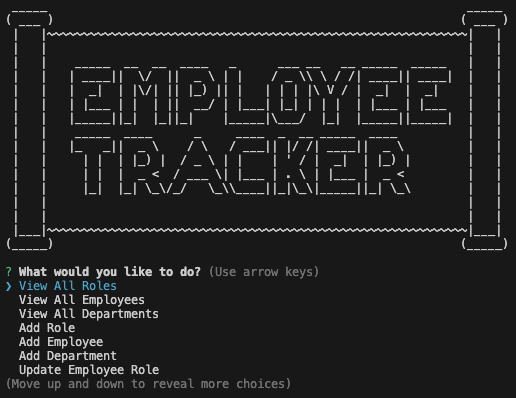

# SQL_Employee_Tracker 

## Description

A command-line applicatino, or Content Management System (CMS), that allows users to easily view and interact with information stored in a database, in order to manage a company's employee databse.

This applictaion uses:

- [Inquierer Package](https://www.npmjs.com/package/inquirer/v/8.2.4)
- [MySQL2 Package](https://www.npmjs.com/package/mysql2)

[YouTube: Name of vido that will eventually be put in here!](I need to make YouTube video so I can put a link here!)

 

## Tabel on Contents

- [SQL_Employee_Tracker ](#sql_employee_tracker---) 
- [Description](#description) 
- [Tabel on Contents](#tabel-on-contents) 
- [User Story](#user-story) 
- [Acceptance Criteria](#acceptance-criteria) 
- [Installation](#installation) 
- [Usage](#usage) 
- [License](#license) 
- [Contributing](#contributing) 
- [Tests](#tests) 
- [Resources](#resources) 
- [Questions/Contact](#questionscontact)

## User Story

**AS A** business owner  

**I WANT** to be able to view and manage the departments, roles, and employees in my company  

**SO THAT** I can organize and plan my business

## Acceptance Criteria

**GIVEN** a command-line application that accepts user input

**WHEN** I start the application  
**THEN** I am presented with the following options: view all departments, view all roles, view all employees, add a department, add a role, add an employee, and update an employee role

**WHEN** I choose to view all departments  
**THEN** I am presented with a formatted table showing department names and department ids

**WHEN** I choose to view all roles  
**THEN** I am presented with the job title, role id, the department that role belongs to, and the salary for that role

**WHEN** I choose to view all employees  
**THEN** I am presented with a formatted table showing employee data, including employee ids, first names, last names, job titles, departments, salaries, and managers that the employees report to

**WHEN** I choose to add a department  
**THEN** I am prompted to enter the name of the department and that department is added to the database

**WHEN** I choose to add a role  
**THEN** I am prompted to enter the name, salary, and department for the role and that role is added to the database

**WHEN** I choose to add an employee  
**THEN** I am prompted to enter the employee’s first name, last name, role, and manager, and that employee is added to the database

**WHEN** I choose to update an employee role  
**THEN** I am prompted to select an employee to update and their new role and this information is updated in the database

## Installation

1. Clone reposityory from GitHub
2. In the index.js file, on line 148, reaname "READMEtest.md" to "README.md"
3. Open an integrated terminal for the "index.js" file
4. Run "npm i" command to install all dependencies or devDependencies from the package. json file
5. Run "node index.js" to begin running Js file

## Usage

1. Verify installation steps have been completed
2. Read promps carefully, and answer each thuroughly, pressing Enter after answering each prompt
3. Once all promps have been answered a "README.md" file will be generated
4. Copy/Paste new "README.md" file into your project

- Here is the code used in the generateMarkdown.js file to generate License Badges

generateMarkdown.js function for License Badges =
[function licenseBadge(data)](https://github.com/TheOarsman/README-Generator/blob/3eca79a8bfa63ae587d0ee5f459b5adc3a14d5e2/utils/generateMarkdown.js#L2-L24)

## License

Copyright 2023 Heinz Ulrich V

Licensed under the Apache License, Version 2.0 (the "License");
you may not use this file except in compliance with the License.
You may obtain a copy of the License at

       http://www.apache.org/licenses/LICENSE-2.0

Unless required by applicable law or agreed to in writing, software
distributed under the License is distributed on an "AS IS" BASIS,
WITHOUT WARRANTIES OR CONDITIONS OF ANY KIND, either express or implied.
See the License for the specific language governing permissions and
limitations under the License.

## Contributing

N/A

## Tests

None currently

## Resources

[How to use Inquirer.js](https://javascript.plainenglish.io/how-to-inquirer-js-c10a4e05ef1f)

[ASCII Art Generator](https://www.asciiart.eu/text-to-ascii-art)

## Questions/Contact

Developer: Heinz Ulrich V

GitHub: [TheOarsman](https://www.github.com/TheOarsman)

LinkedIn: [Heinz Ulrich V](https://www.linkedin.com/in/heinz-ulrich-v-3a3486a0/)

E-Mail: <heinzulrichv@gmail.com>
